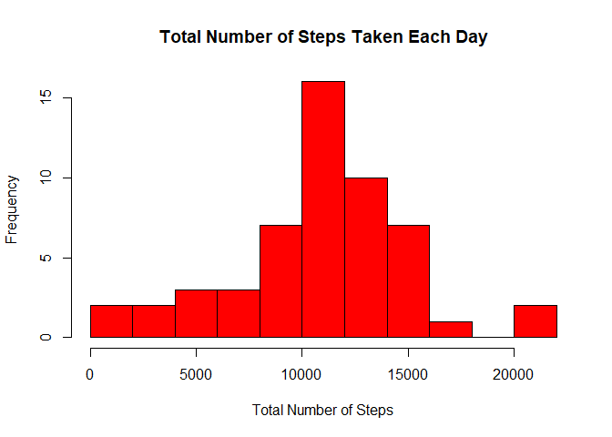
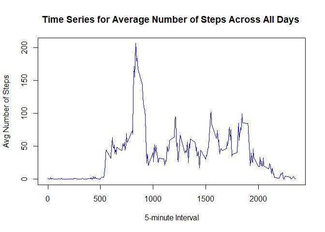
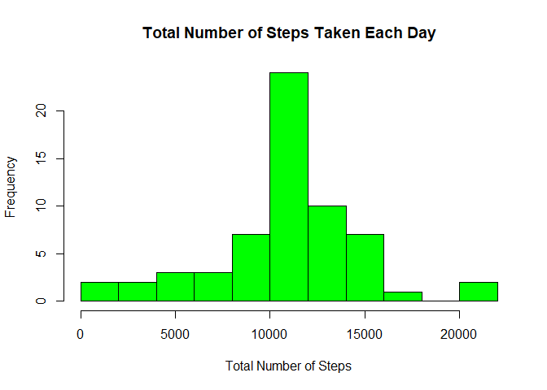
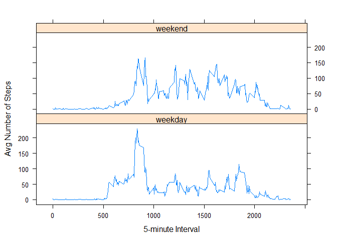

## Set working directory

```r
setwd("C:/Users/Thaddeus/Documents/GitHub/RepData_PeerAssessment1")
```


## Download and unzip the file

```r
if(!file.exists(".")){dir.create(".")}
fileUrl <- "https://d396qusza40orc.cloudfront.net/repdata%2Fdata%2Factivity.zip"
download.file(fileUrl, destfile="./Dataset.zip")
unzip(zipfile="./Dataset.zip",exdir=".")  
```


## Loading and preprocessing the data
Show any code that is needed to  

1. Load the data (i.e. **read.csv()**)   

2. Process/transform the data (if necessary) into a format suitable for your analysis

```r
activity <- read.csv("activity.csv")
dim(activity)
```

```
## [1] 17568     3
```

```r
head(activity)
```

```
##   steps       date interval
## 1    NA 2012-10-01        0
## 2    NA 2012-10-01        5
## 3    NA 2012-10-01       10
## 4    NA 2012-10-01       15
## 5    NA 2012-10-01       20
## 6    NA 2012-10-01       25
```

```r
summary(activity)
```

```
##      steps                date          interval     
##  Min.   :  0.00   2012-10-01:  288   Min.   :   0.0  
##  1st Qu.:  0.00   2012-10-02:  288   1st Qu.: 588.8  
##  Median :  0.00   2012-10-03:  288   Median :1177.5  
##  Mean   : 37.38   2012-10-04:  288   Mean   :1177.5  
##  3rd Qu.: 12.00   2012-10-05:  288   3rd Qu.:1766.2  
##  Max.   :806.00   2012-10-06:  288   Max.   :2355.0  
##  NA's   :2304     (Other)   :15840
```


## What is the mean total number of steps taken per day?  
For this part of the assignment, you can ignore the missing values in the dataset.  

1. Calculate the total number of steps taken per day  

```r
totalsteps_perday <- aggregate(steps ~ date, data = activity, sum, na.rm = TRUE)
totalsteps_perday
```

```
##          date steps
## 1  2012-10-02   126
## 2  2012-10-03 11352
## 3  2012-10-04 12116
## 4  2012-10-05 13294
## 5  2012-10-06 15420
## 6  2012-10-07 11015
## 7  2012-10-09 12811
## 8  2012-10-10  9900
## 9  2012-10-11 10304
## 10 2012-10-12 17382
## 11 2012-10-13 12426
## 12 2012-10-14 15098
## 13 2012-10-15 10139
## 14 2012-10-16 15084
## 15 2012-10-17 13452
## 16 2012-10-18 10056
## 17 2012-10-19 11829
## 18 2012-10-20 10395
## 19 2012-10-21  8821
## 20 2012-10-22 13460
## 21 2012-10-23  8918
## 22 2012-10-24  8355
## 23 2012-10-25  2492
## 24 2012-10-26  6778
## 25 2012-10-27 10119
## 26 2012-10-28 11458
## 27 2012-10-29  5018
## 28 2012-10-30  9819
## 29 2012-10-31 15414
## 30 2012-11-02 10600
## 31 2012-11-03 10571
## 32 2012-11-05 10439
## 33 2012-11-06  8334
## 34 2012-11-07 12883
## 35 2012-11-08  3219
## 36 2012-11-11 12608
## 37 2012-11-12 10765
## 38 2012-11-13  7336
## 39 2012-11-15    41
## 40 2012-11-16  5441
## 41 2012-11-17 14339
## 42 2012-11-18 15110
## 43 2012-11-19  8841
## 44 2012-11-20  4472
## 45 2012-11-21 12787
## 46 2012-11-22 20427
## 47 2012-11-23 21194
## 48 2012-11-24 14478
## 49 2012-11-25 11834
## 50 2012-11-26 11162
## 51 2012-11-27 13646
## 52 2012-11-28 10183
## 53 2012-11-29  7047
```

2. If you do not understand the difference between a histogram and a barplot, research the difference between them.  
    Make a histogram of the total number of steps taken each day  

```r
hist(totalsteps_perday$steps, col = "red", main = "Total Number of Steps Taken Each Day", xlab = "Total Number of Steps", breaks = 10)
```

<!-- -->

3. Calculate and report the mean and median of the total number of steps taken per day  

```r
summary(totalsteps_perday)
```

```
##          date        steps      
##  2012-10-02: 1   Min.   :   41  
##  2012-10-03: 1   1st Qu.: 8841  
##  2012-10-04: 1   Median :10765  
##  2012-10-05: 1   Mean   :10766  
##  2012-10-06: 1   3rd Qu.:13294  
##  2012-10-07: 1   Max.   :21194  
##  (Other)   :47
```

```r
totalmean <- mean(totalsteps_perday$steps, na.rm = TRUE)
totalmean
```

```
## [1] 10766.19
```

```r
totalmedian <- median(totalsteps_perday$steps, na.rm = TRUE) 
totalmedian
```

```
## [1] 10765
```
- The mean and median of the total number of steps taken per day is 1.0766189\times 10^{4} and 10765.  


## What is the average daily activity pattern?  

1. Make a time series plot (i.e. **type = "l"**) of the 5-minute interval (x-axis) and the average number of steps taken, averaged across all days (y-axis)  

```r
avgsteps_interval <- aggregate(steps ~ interval, data = activity, mean)
summary(avgsteps_interval)
```

```
##     interval          steps        
##  Min.   :   0.0   Min.   :  0.000  
##  1st Qu.: 588.8   1st Qu.:  2.486  
##  Median :1177.5   Median : 34.113  
##  Mean   :1177.5   Mean   : 37.383  
##  3rd Qu.:1766.2   3rd Qu.: 52.835  
##  Max.   :2355.0   Max.   :206.170
```

```r
# Plotting the graph
plot(avgsteps_interval$steps ~ avgsteps_interval$interval, type = "l", main = "Time Series for Average Number of Steps Across All Days ", xlab = "5-minute Interval", ylab = "Avg Number of Steps", col = "blue")
```

<!-- -->

2. Which 5-minute interval, on average across all the days in the dataset, contains the maximum number of steps?  

```r
max_steps <- which.max(avgsteps_interval$steps)
max_steps_interval <- avgsteps_interval[max_steps, ]
max_steps_interval
```

```
##     interval    steps
## 104      835 206.1698
```
- Interval 835 contains the maximum number of steps, 206.1698113.  


## Imputing missing values  
Note that there are a number of days/intervals where there are missing values (coded as **NA**). The presence of missing days may introduce bias into some calculations or summaries of the data.  

1. Calculate and report the total number of missing values in the dataset (i.e. the total number of rows with **NAs**)  

```r
missingvalue <- colSums(is.na(activity))
missingvalue
```

```
##    steps     date interval 
##     2304        0        0
```
- The total number of missing values in the dataset is 2304, 0, 0. Only column steps has missing data.

2. Devise a strategy for filling in all of the missing values in the dataset. The strategy does not need to be sophisticated. For example, you could use the mean/median for that day, or the mean for that 5-minute interval, etc.  
- Mean for that 5-minute interval will be used to fill in all the missing values in the dataset.

3. Create a new dataset that is equal to the original dataset but with the missing data   filled in.  

```r
activity_new <- activity
for (i in 1:nrow(activity_new)) {
  if (is.na(activity_new$steps[i])) 
  { interval <- activity_new$interval[i]
    steps <- avgsteps_interval[avgsteps_interval$interval == interval, ] 
    activity_new$steps[i] <- steps$steps} 
  }
head(activity_new)
```

```
##       steps       date interval
## 1 1.7169811 2012-10-01        0
## 2 0.3396226 2012-10-01        5
## 3 0.1320755 2012-10-01       10
## 4 0.1509434 2012-10-01       15
## 5 0.0754717 2012-10-01       20
## 6 2.0943396 2012-10-01       25
```

```r
# Check the dimension of the dataset
dim(activity_new)
```

```
## [1] 17568     3
```

```r
# Check number of missing value
colSums(is.na(activity_new))
```

```
##    steps     date interval 
##        0        0        0
```

4. Make a histogram of the total number of steps taken each day and Calculate and report the **mean** and **median** total number of steps taken per day. Do these values differ from the estimates from the first part of the assignment? What is the impact of imputing missing data on the estimates of the total daily number of steps?  

```r
newtotalsteps_perday <- aggregate(steps ~ date, data = activity_new, sum)
head(newtotalsteps_perday)
```

```
##         date    steps
## 1 2012-10-01 10766.19
## 2 2012-10-02   126.00
## 3 2012-10-03 11352.00
## 4 2012-10-04 12116.00
## 5 2012-10-05 13294.00
## 6 2012-10-06 15420.00
```

```r
hist(newtotalsteps_perday$steps, col = "green", main = "Total Number of Steps Taken Each Day", xlab = "Total Number of Steps", breaks = 10)
```

<!-- -->

```r
summary(newtotalsteps_perday)
```

```
##          date        steps      
##  2012-10-01: 1   Min.   :   41  
##  2012-10-02: 1   1st Qu.: 9819  
##  2012-10-03: 1   Median :10766  
##  2012-10-04: 1   Mean   :10766  
##  2012-10-05: 1   3rd Qu.:12811  
##  2012-10-06: 1   Max.   :21194  
##  (Other)   :55
```

```r
mean(newtotalsteps_perday$steps)
```

```
## [1] 10766.19
```

```r
median(newtotalsteps_perday$steps) 
```

```
## [1] 10766.19
```
- The new mean is exactly the same as the mean from the first part of assignment and the median has changed. New median is the same as new mean because we have imputed the mean as the missing value.  


## Are there differences in activity patterns between weekdays and weekends?  
For this part the **weekdays()** function may be of some help here. Use the dataset with the filled-in missing values for this part.  

1. Create a new factor variable in the dataset with two levels - "weekday" and "weekend" indicating whether a given date is a weekday or weekend day.  

```r
activity_new$day = weekdays(as.Date(activity_new$date))
type <- activity_new$day
for (i in 1:length(type)) {
    if ((type[i] == "Saturday") | (type[i] == "Sunday")) 
    { type[i] = "weekend" } 
    else { type[i] = "weekday" }
}
activity_new$levels <- as.factor(type) 
head(activity_new)
```

```
##       steps       date interval    day  levels
## 1 1.7169811 2012-10-01        0 Monday weekday
## 2 0.3396226 2012-10-01        5 Monday weekday
## 3 0.1320755 2012-10-01       10 Monday weekday
## 4 0.1509434 2012-10-01       15 Monday weekday
## 5 0.0754717 2012-10-01       20 Monday weekday
## 6 2.0943396 2012-10-01       25 Monday weekday
```

2. Make a panel plot containing a time series plot (i.e. **type = "l"**) of the 5-minute interval (x-axis) and the average number of steps taken, averaged across all weekday days or weekend days (y-axis). See the README file in the GitHub repository to see an example of what this plot should look like using simulated data.

```r
library(lattice)
avgsteps_interval_new <- aggregate(steps ~ interval + levels, data = activity_new, mean)
xyplot(steps ~ interval | levels, data = avgsteps_interval_new, type = "l", layout = c(1, 2), xlab = "5-minute Interval", ylab = "Avg Number of Steps")
```

<!-- -->
